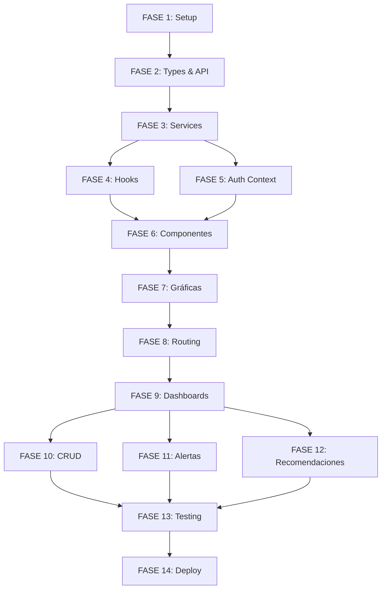

# 📑 ÍNDICE DE DOCUMENTACIÓN - FRONTEND

Este índice te ayudará a navegar por toda la documentación del proyecto frontend.

---

## 🎯 INICIO RÁPIDO

**Para empezar AHORA mismo:**

1. Lee: **README.md** (este directorio)
2. Sigue: **FASE_1_SETUP_INICIAL.md**
3. Continúa en orden: FASE 2 → FASE 3 → ...

---

## 📚 DOCUMENTOS PRINCIPALES

### 1. Documentos de Referencia General

| Archivo | Propósito | Cuándo usar |
|---------|-----------|-------------|
| **README.md** | Visión general del proyecto, quick start | Primera lectura |
| **SYSTEM_ANALYSIS.md** | Análisis completo del sistema (backend + frontend) | Para entender arquitectura completa |
| **PLAN_IMPLEMENTACION_FRONTEND.md** | Plan maestro con resumen de 14 fases | Para planificar trabajo |

### 2. Documentos de Implementación Detallada

| Fase | Archivo | Contenido | Duración |
|------|---------|-----------|----------|
| 1 | **FASE_1_SETUP_INICIAL.md** | Setup Vite, TailwindCSS, DaisyUI, estructura de carpetas | 2-3 días |
| 2 | **FASE_2_TYPES_Y_API.md** | TypeScript types, configuración Axios, interceptors | 2-3 días |
| 3 | **FASE_3_SERVICES.md** | Servicios API completos (auth, users, metrics, alerts, etc.) | 2-3 días |
| 4-14 | **RESUMEN_FASES_4_14.md** | Resumen ejecutivo de fases restantes | Referencia rápida |

### 3. Documentos del Backend (en ../ZZZ-Backend)

| Archivo | Propósito |
|---------|-----------|
| `ZZZ-Backend/README.md` | Documentación completa del backend |
| `ZZZ-Backend/GUIA_PRUEBAS_API.md` | Cómo probar endpoints con curl |
| `ZZZ-Backend/PROJECT_CONTEXT.md` | Contexto general del proyecto |
| `ZZZ-Backend/FRONTEND_CONTEXT.md` | Contexto específico para frontend |

---

## 🗺️ ROADMAP DE LECTURA

### Si eres NUEVO en el proyecto:

```
1. README.md (este directorio)
   ↓
2. SYSTEM_ANALYSIS.md (entender arquitectura)
   ↓
3. PLAN_IMPLEMENTACION_FRONTEND.md (ver plan completo)
   ↓
4. FASE_1_SETUP_INICIAL.md (empezar implementación)
```

### Si ya conoces el proyecto:

```
RESUMEN_FASES_4_14.md (referencia rápida)
```

### Si tienes dudas sobre el backend:

```
../ZZZ-Backend/README.md
../ZZZ-Backend/GUIA_PRUEBAS_API.md
http://localhost:8000/api/docs/ (Swagger)
```

---

## 📋 CHECKLIST DE FASES

### Fases Críticas (Orden obligatorio)

- [ ] **FASE 1**: Setup Inicial
  - Archivo: FASE_1_SETUP_INICIAL.md
  - Crear proyecto Vite
  - Instalar TailwindCSS + DaisyUI
  - Configurar estructura de carpetas

- [ ] **FASE 2**: Types y API
  - Archivo: FASE_2_TYPES_Y_API.md
  - Definir todos los TypeScript types
  - Configurar Axios con interceptors
  - Auto-refresh de JWT

- [ ] **FASE 3**: Services
  - Archivo: FASE_3_SERVICES.md
  - authService (login, logout, getCurrentUser)
  - userService (CRUD supervisores/empleados)
  - metricsService, alertService, etc.

- [ ] **FASE 4**: Hooks y Utils
  - Archivo: RESUMEN_FASES_4_14.md (sección FASE 4)
  - useAuth, useFetch, useRealtime
  - formatters, validators, colorUtils

- [ ] **FASE 5**: Auth Context
  - Archivo: RESUMEN_FASES_4_14.md (sección FASE 5)
  - AuthContext con user state
  - ProtectedRoute component

- [ ] **FASE 6**: Componentes Comunes
  - Archivo: RESUMEN_FASES_4_14.md (sección FASE 6)
  - Card, Button, Modal, Table, etc.

- [ ] **FASE 7**: Gráficas
  - Archivo: RESUMEN_FASES_4_14.md (sección FASE 7)
  - FatigueLineChart, HeartRateChart, etc.

- [ ] **FASE 8**: Routing y Layouts
  - Archivo: RESUMEN_FASES_4_14.md (sección FASE 8)
  - MainLayout, AuthLayout
  - Router con rutas protegidas

- [ ] **FASE 9**: Dashboards
  - Archivo: RESUMEN_FASES_4_14.md (sección FASE 9)
  - Admin, Supervisor, Employee dashboards

- [ ] **FASE 10-12**: Features
  - Archivo: RESUMEN_FASES_4_14.md (secciones 10-12)
  - CRUD usuarios, Sistema de alertas, Recomendaciones

- [ ] **FASE 13**: Testing
  - Archivo: RESUMEN_FASES_4_14.md (sección 13)
  - Unit tests, Integration tests, E2E tests

- [ ] **FASE 14**: Deployment
  - Archivo: RESUMEN_FASES_4_14.md (sección 14)
  - Build, optimización, deploy

---

## 🔍 BUSCAR INFORMACIÓN ESPECÍFICA

### ¿Cómo hacer...?

| Pregunta | Documento | Sección |
|----------|-----------|---------|
| ¿Cómo configurar el proyecto? | FASE_1_SETUP_INICIAL.md | Todo el documento |
| ¿Qué types usar? | FASE_2_TYPES_Y_API.md | Secciones 2.1 - 2.7 |
| ¿Cómo llamar a la API? | FASE_3_SERVICES.md | Servicios específicos |
| ¿Cómo autenticar? | FASE_3_SERVICES.md | 3.1 authService |
| ¿Cómo crear gráficas? | RESUMEN_FASES_4_14.md | FASE 7 |
| ¿Cómo proteger rutas? | RESUMEN_FASES_4_14.md | FASE 5 y FASE 8 |
| ¿Endpoints del backend? | PLAN_IMPLEMENTACION_FRONTEND.md | Sección "Endpoints Implementados" |
| ¿Cómo hacer polling? | RESUMEN_FASES_4_14.md | FASE 4 (useRealtime) |

### ¿Problemas comunes?

| Problema | Solución |
|----------|----------|
| Error de CORS | Ver ../ZZZ-Backend/TROUBLESHOOTING.md |
| Error 401 Unauthorized | Verificar token en localStorage, ver FASE_3 |
| TypeScript errors | Verificar types en FASE_2 |
| Componentes no renderizan | Verificar imports y DaisyUI config |
| Gráficas no se muestran | Verificar Chart.js registration |

---

## 📊 DEPENDENCIAS ENTRE FASES



**Regla de oro:** NO saltar fases. Cada una depende de la anterior.

---

## 🎯 OBJETIVOS POR SEMANA

| Semana | Fases | Objetivo | Resultado esperado |
|--------|-------|----------|-------------------|
| 1 | 1-3 | Setup y base técnica | Login funcionando |
| 2 | 4-6 | Infraestructura | Componentes listos |
| 3 | 7-8 | UI y navegación | Routing completo |
| 4-5 | 9 | Feature principal | 3 dashboards funcionando |
| 6 | 10-11 | CRUD y alertas | Gestión completa |
| 7 | 12 | Features secundarias | App completa |
| 8 | 13 | Testing | App testeada |
| 9 | 14 | Deploy | App en producción |

---

## 🛠️ COMANDOS ÚTILES

```bash
# Iniciar proyecto
npm create vite@latest fatigue-frontend -- --template react-ts
cd fatigue-frontend
npm install

# Desarrollo
npm run dev              # http://localhost:5173

# Build
npm run build
npm run preview

# Linting
npm run lint
npm run lint:fix

# Testing
npm run test
npm run test:e2e
```

---

## 📞 RECURSOS DE AYUDA

### Documentación Online
- React: https://react.dev/
- TypeScript: https://www.typescriptlang.org/docs/
- DaisyUI: https://daisyui.com/components/
- Chart.js: https://www.chartjs.org/docs/latest/

### Backend
- Swagger UI: http://localhost:8000/api/docs/
- ReDoc: http://localhost:8000/api/redoc/

### Archivos Locales
- Backend README: `../ZZZ-Backend/README.md`
- Guía API: `../ZZZ-Backend/GUIA_PRUEBAS_API.md`

---

## ✅ VERIFICACIÓN DE PROGRESO

### Hitos Clave

- [ ] **Hito 1**: Proyecto Vite corriendo (FASE 1)
- [ ] **Hito 2**: Login exitoso con backend (FASE 3 + 5)
- [ ] **Hito 3**: Navegación entre páginas (FASE 8)
- [ ] **Hito 4**: Dashboard de empleado mostrando métricas (FASE 9)
- [ ] **Hito 5**: Dashboard de supervisor con equipo (FASE 9)
- [ ] **Hito 6**: CRUD de empleados funcionando (FASE 10)
- [ ] **Hito 7**: Alertas resolviéndose (FASE 11)
- [ ] **Hito 8**: Tests pasando (FASE 13)
- [ ] **Hito 9**: App en producción (FASE 14)

---

## 📝 NOTAS FINALES

### Antes de empezar
1. ✅ Leer README.md completo
2. ✅ Verificar backend corriendo
3. ✅ Revisar SYSTEM_ANALYSIS.md para contexto

### Durante la implementación
1. ✅ Seguir fases en orden
2. ✅ Completar checklist de cada fase
3. ✅ Probar inmediatamente después de implementar
4. ✅ Hacer commits frecuentes

### Al finalizar cada fase
1. ✅ Marcar fase como completada
2. ✅ Verificar que todo funciona
3. ✅ Leer siguiente fase antes de empezar

---

**¡Éxito con la implementación!** 🚀

Para empezar: **Abre FASE_1_SETUP_INICIAL.md**
